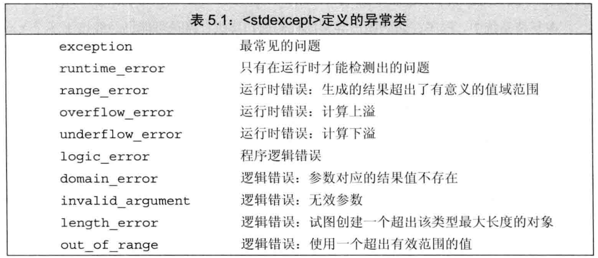

# C++ 语句

## 1. 条件语句

### 1.1 if

### 1.2 switch

+ switch 未遇到 break 时会自动向下继续执行！

```c++
switch (ch) {
    case 'a':
    case 'e':
    case 'i':
    case 'u':
    case 'o':
        ++vowelCnt;
        break;
}
```

+ switch 内部变量定义
  + 若某处一个带有初值的变量位于作用域外，另一处位于作用域内，则非法
  + 如果需要为 case 定义变量，最好放在 case 后的 {} 块作用域内

> 见 问题.md

---

## 2. 循环语句

+ while
+ do while
+ for
+ range for

---

## 3. 跳转语句

+ break
+ continue
+ goto
  + goto 不能跳过变量定义
  + 不能将程序的控制权从作用域内跳到作用域外
  + 可以跳到变量定义之前
    + 此时会销毁该变量，重新声明
  + 一般用于跳出循环，如报错

---

## 4. 异常处理

### 4.1 throw 语句

+ throw 语句会抛出一个错误
+ 例如，throw runtime_error("Invalid Input")
  + 其中，错误定义在 stdexcept

### 4.2 try 语句块

+ 基本形式

```c++
try {
    do_something();
} catch (runtime_error err) {
    cout << err.what()
         << "Try again" << endl;
}
```

+ 其中 what 成员函数为 RTE 初始化时使用的字符串的副本，为 C 风格字符串
+ 如果没有找到合适的 catch ，会交给系统的 terminate()，导致异常退出

### 4.3 标准异常相关的头文件

+ \<exception>
  + 定义了最常见的异常类 exception
  + 只报告错误发生，不提供额外信息
  + ==**只能默认初始化**==
+ \<stdexcept>
  + 定义了常见的异常类
  + 
+ \<new>
  + 定义了 bad_alloc 异常类型
  + ==**只能默认初始化**==
+ \<type_info>
  + 定义了 bad_cast 异常类型
  + ==**只能默认初始化**==
