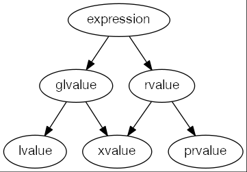

# C++ Value 类型

## 1. 右值引用的定义与性质

> ZEN OF LVALUE AND RVALUE:
> lvalues are persistent, rvalues are temporary
> lvalues are copied, rvalues are moved

+ 语法：T &&var = rvalue;
+ 只能绑定到右值
+ 右值是临时的
  + 返回非引用的函数，算数表达式结果，后置递增递减符号
+ 右值引用的性质
  + 所引用的对象将被销毁
  + 对象没有其他用户
  + 可以自由地被其他代码接管资源，即“窃取”
+ 变量是左值
  + 右值引用的变量 ==**本身是左值**==，不能绑定右值引用 到 右值引用的变量
  + 如，int &&rr1 = 42; int &&rr2 = rr1; // 错误

### 1.1 std::move

+ move 的本质是 static_cast\<T&&>(x)
  + 生成 xvalue
+ move 的返回值是 右值引用
  + 结果也是 xvalue
+ move 是一种保证，保证原本的左值将不再被使用
  + 可以销毁一个移动源对象，可以赋予新值，但是 ==**不可以使用移动源对象**==
+ 注意，应当使用 std::move 而非使用 using 声明
  + 应当避免潜在的命名冲突

#### 1.1 move 的对象

+ 对于内置类型，没有必要 move，也无法 move
  + 因为 move 只是生成一个 xvalue
  + 因此最终还是会调用 拷贝 行为
+ 从语义上理解
  + move 是让对象拥有的资源的所有权转换
    + 但内置类型没有资源，也没必要 move
  + move 是为了让表达式变成 move-eligible
    + 更有可能在 overload-resolution 匹配到接受右值引用的函数

```c++
int x = 0;
int y = std::move(x);
```

+ 这里发生 implicit conversion 中的 lvalue-to-rvalue conversion
  + 本质上，还是进行了

### 1.2 std::move 的实战

+ 如，连接字符串

```c++
std::string s;
for (int i = 0; i != n; ++i)
  // s = s + 'a' 是缓慢的
  // 由于要先产生 s 的拷贝变成 rvalue
  // 再 +'a'，再 move 给 s（这里是 move 因为 rhs 是右值）
  s = std::move(s) + 'a';
  // 是高效的
```

+ 或者也可以等价于

```c++
s += 'a'; // s = std::move(s) + 'a';
```

### 1.3 拷贝消除(copy elision)

```c++
std::string foo(const std::string &a, const std::string &b) {
  return a + b; 
  // a temporary
  // 为何不产生拷贝？(c++17后)
} 
std::string s = foo(a, b);
```

+ 发生了拷贝消除
  + 对于返回 prvalue 用于初始化其他变量时
  + 默认相当于 std::string s(a + b)，做移动构造

### 1.4 NRVO (since C++11)

```c++
Dynarray concat(const Dynarray &a, const Dynarray &b) {
  Dynarray result(a.size() + b.size());
  for (std::size_t i = 0; i != a.size(); ++i)
    result.at(i) = a.at(i);
  for (std::size_t i = 0; i != b.size(); ++i)
    result.at(a.size() + i) = b.at(i);
  return result;
}
a = concat(b, c);
```

+ return name 在 c++11 后会 ==**移动构造**== 一个对象
+ 进而 ==**移动构造**== a
+ 因此 ==**不要自作聪明 return std::move(...)**==
+ NRVO 改进后的 **伪代码**:

```c++
// Pseudo C++ code.
void concat(Dynarray &result, const Dynarray &a, const Dynarray &b) {
  // Pseudo C++ code. For demonstration only.
  result.Dynarray::Dynarray(a.size() + b.size()); 
  // construct in-place
  // ...
}
Dynarray a@; // Uninitialized.
concat(a@, b, c);
```

## 2. 值的类型


