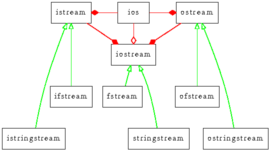
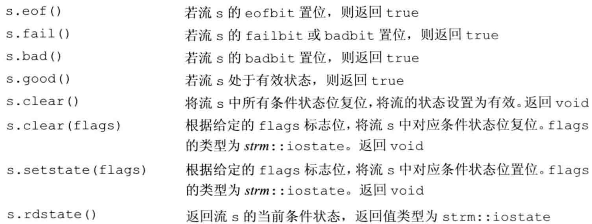
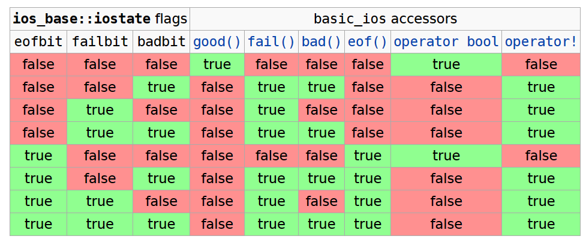
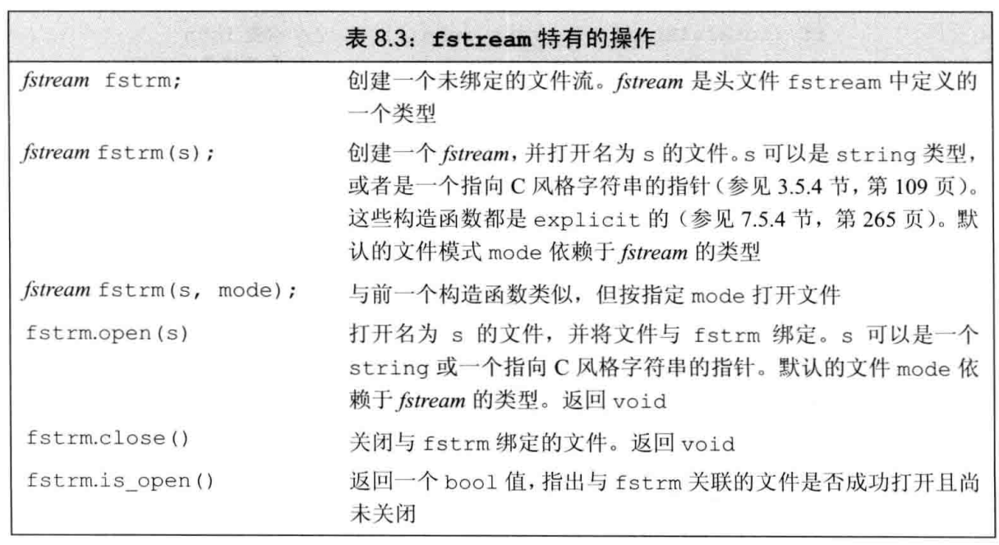
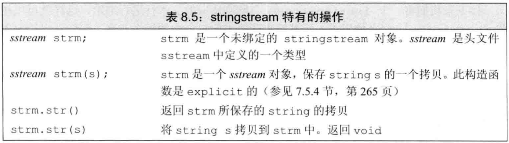

# C++ IO

## 1. IO类



### 1.1 IO类概述

+ io 的每个头文件提供了支持 `char` 与 `wchar_t` 版的两种读写类

| 头文件 | 普通版本 | **宽字符**版本 |
| --- | --- | --- |
| `<iostream>` | `istream` | `wistream` |
| | `ostream` | `wostream` |
| | `iostream` | `wiostream` |
| `<fstream>` | `ifstream` | `wifstream` |
| | `ofstream` | `wofstream` |
| | `fstream` | `wfstream` |
| `<sstream>` | `istringstream` | `wistringstream` |
| | `ostringstream` | `wosstringstream` |
| | `stringstream` | `wstringstream` |

+ 使用方法简谈
  + 对于普通版本，与 `std::cin`, `std::cout` 相同
  + 对于宽字符版本，使用 `std::wcin`, `std::wcout`, `std::wcerr` 等

```c++
std::string str;
std::getline(std::cin >> std::ws, str);
// std::cin >> std::ws 以 std::isspace 为标准忽略开头的空白字符
// 如：\n, \t, 空格, ...
```

### 1.2 IO类无拷贝或赋值

+ IO类不允许拷贝或赋值
+ 一般以引用传递
  + 由于读写会改变状态，一般采用 `const &`

### 1.3 IO类的状态

> 假设 strm 为上述的一种 io 类型，如 `std::iostream`

+ 类型定义：
  + `strm::iostate` 为一种 io 状态类型，通过置位确定
+ 成员变量
  + `strm::badbit` 用于指出流已崩溃，**==发生无法恢复的错误==**
  + `strm::failbit` 用于指出 一个IO操作失败了
  + `strm::eofbit` 用于指出流到达了文件末尾
  + `strm::goodbit` 用于指出流正常
  + 以上都是 **`constexpr strm::iostate`** 类型
+ 成员函数
  + 

> IO错误的例子

```c++
int ival;
std::cin >> ival; // 读入字母'B'或EOF
```

+ 此时发生错误
  + cin 被置为 `fail()` 或 `fail() + eof()`
  + 因此，代码 **应当检查cin状态**
    + 如：`while (cin >> ival) { ... }`

+ 检查 IO 流的状态
  + 使用 s.rdstate() 返回流状态
  + 使用 s.clear() 清除流状态，随后 必定s.good() 必定返回 true
    + 使用 `s.clear(strm::iostate newState)` 清除流状态到指定情况
    + 如：`cin.clear(cin.rdstate() & ~cin.failbit & ~cin.badbit)`

> iostate 的可能状态



### 1.4 管理缓冲

> 理念：由于读写操作 **可能** 会很耗时，因此允许操作系统合并多次读写可以很大提升性能

+ 缓冲区刷新的条件
  + 程序结束
  + 缓冲区满
  + 操纵符，如 std::endl
  + 开启 std::unitbuf
  + 读写关联的流，如写入 `cerr` 或 读取 `cin` 会导致 `cout` 立即刷新

> 关联输入流、输出流的好处：所有的提示，包括用户提示信息，会在读操作之前被输出

+ 手动刷新缓冲区

| - | 操作符 | 效果 |
| --- | --- | --- |
| `std::cout<<` | `std::endl` | 换行+刷新缓冲区 |
| | `std::flush` | 刷新缓冲区 |
| | `std::ends` | 空字符+刷新缓冲区 |
| | `std::unitbuf` | 开启：任何输出都会立即刷新缓冲区 |
| | `std::nounitbuf` | 关闭 `unitbuf` |

+ 关联流的方法：`stream.tie()`
  + 重载1：`stream.tie()`，若关联到流则返回该流的`std::ostream *`指针，否则返回**空指针**
  + 重载2：`stream.tie(&ostream)`，传入**另一个==ostream==流的指针**，并将自身**关联到另一个流**
+ 一个流只能关联==一个 ostream==，但多个流可以 ==关联到同一个 ostream==

## 2. 文件 IO

### 2.1 fstream 的操作

+ fstream 可以采用与 `std::iostream` 相同的操作，如 `<<` 和 `>>`
+ fstream 特有的操作如下



### 2.2 使用文件流对象

+ 创建文件流对象
  + 使用 `fstrm varName(str, mode)` 创建一个文件对象
  + 若提供了文件名，会自动打开文件(open)
    + `ifstream in(ifile)`
    + `ofstream out`
  + 在旧版本中，只支持 C 风格字符串作为文件名；现在支持 `std::string`
+ strm 类型参数传参
  + 可以将子类传递给父类指针，如：ofstream -> ostream

> 成员函数：`open` 与 `close`

```c++
std::ifstream in(infile);
std::ofstream out;
out.open(infile + ".copy"); 
```

+ 如果打开失败，failbit 被置位
  + 可以采用 `if (out)` 或 `out.is_open()` 检测文件是否打开成功
  + 此处发生 contextual conversion，调用 `operator bool`
+ 文件流只能打开一次
  + 如果再次 `open` 任何文件，`failbit` 被置位，且后续所有操作失败
  + 可以先 `close` 再 `open` 新的文件

> 自动构造与析构

```c++
//对每个传递给程序的文件执行循环操作
for (auto p = argv + 1; p != argv + argc; ++p) {
    ifstream input(*p);
    if (input) {
        process(input);
    } else {
        cerr << "couldn't open: " << string(*p);
    }
}
```

+ 考虑如上程序
  + 当离开 `ifstream` 的作用域时
  + `*p` 被自动销毁，此时会调用 `input.close()`

### 2.3 文件模式

> 可用的文件读写模式

| 读写模式 | 含义 | 限制条件 |
| --- | --- | --- |
| `std::strm::in` | 读取 | ==**唯二**== 保护文件内容的模式（显式指定时） |
| `std::strm::out` | 写入 | 隐式保证 `trunc` |
| `std::strm::app` | 追加 | 不与 `trunc` 共存 <br> 默认以 `out` 打开 <br> ==**唯二**== 保护文件内容的模式（显式指定时） |
| `std::strm::ate` | 打开时立即定位到文件末(at end) | 可与任意其他组合 |
| `std::strm::trunc` | 截断 | 不与 `app` 共存 <br> 只能在 `out` 时使用 |
| `std::strm::binary` | 以二进制进行 IO | 可与任意其他组合 |

> 以 `out` 打开文件会丢失数据，可指定 `app` 保护

+ 几条等价的【截断写入】打开
  + `ofstream out("file");`
  + `ofstream out("file", ofstream::out);`
  + `ofstream out("file", ofstream::out | ofstream::app);`
+ 几条等价的【保留写入】打开
  + `ofstream out("file", ofstream::app);`
  + `ofstream out("file", ofstream::out | ofstream::app);`

> 默认的打开方式

+ 默认情况下，打开方式与 fstream 类型相同
  + 如，`ofstream` 以 `out` 打开

## 3. string IO

### 3.1 stringstream 的独有操作



### 3.2 istringstream 的例子

> 例：读入人名 与 电话

```c++
/*
数据格式：
    morgan 1234567 1236782
    drew 31213123
    lee 123123 13120312 12839120
*/

struct PersonInfo {
    std::string name;
    std::vector<std::string> phones;
}

int main() {
    std::string line, word;
    std::vector<PersonInfo> people;

    while (getline(std::cin, line)) { 
        // 每次读入一整行数据到 line
        PersonInfo info;
        std::istringstream record(line);
        // 将 line 转化为 istringstream

        line >> info.name; // 读入 name 字段
        while (record >> word) { // 读入所有的 phone 字段
            info.phones.push_back(word);
        }
        people.push_back(info); // 添加人员对象
    }
}

```

### 3.3 ostringstream 的例子

> 例：读出 所有合法的人名与电话

```c++
struct PersonInfo {
    std::string name;
    std::vector<std::string> phones;
}

int main() {
    for (const auto &entry : people) {
        std::ostringstream formatted, badNums;

        // NOTE: Important!
        for (const auto &phoneNumber : entry.phones) {
            if (!valid(phoneNumber)) {
                badNums << " " << phoneNumber;
                // 如果不合法，写入到 badNums
            } else {
                formatted << " " << format(phoneNumber);
                // 若合法，写入到 formatted
            }
        } 

        // NOTE: Important!
        if (badNums.str().empty()) {
            std::cout << entry.name << " "
                <<  formatted.str() << std::endl;
        } else {
            std::cerr << "Input Error from: "
                << entry.name << " "
                << "Invalid Numbers: " << badNums.str() 
                << std::endl;
        }
    }
}
```
