# C++ 顺序容器

## 1. 顺序容器概览

+ 所有的顺序容器都能快速顺序访问，但有其他代价
  + 增/删元素 的 代价
  + 随机访问 的 代价

> Anything about container operation can be found here ↓
> [https://en.cppreference.com/w/cpp/container#Member_function_table]

## 2. 顺序容器类型

| 容器 | 名称 | 特性 | 代价 |
| --- | --- | --- | --- |
| `vector` | 可变大小数组 | 快速随机访问 | 在尾部外的增/删元素很慢 |
| `string` | 字符串 | 同 `vector` |  |
| `deque` | 双端队列 | 快速随机访问 <br> 头尾增删很快 |  |
| `array` | 固定长度数组 | 快速随机访问 | 不能增删元素 |
| `list` | 双向链表 | 快速增删元素 | 只能双向顺序访问 <br> 随机访问时遍历整个容器 <br> **大量的额外内存开销** |
| `forward_list` | 单向链表 | 快速增删元素 | 只能单向顺序访问 <br> **没有 `.size()` 操作以保证效率** |

> 注意：对 `vector` 和 `string` 添加元素**可能会引起内存的重新分配！**

### 2.1 如何选择容器

> Case1: 读取时在容器中插入元素，随后随机访问

+ 方法1：使用 `vector` 追加元素，随后 `sort()` 重排
+ 方法2：若必须在中间插入元素，使用 `list` 输入，再拷贝到 `vector`

> Case2: 同时需要随机插入与随机访问

+ 作相应性能测试，寻找主要性能开销

> Case3: 不确定使用何种容器

+ 先使用迭代器，再必要时再决定 `vector` 还是 `list`

## 3. 顺序容器的通用操作

### 3.1 类型别名

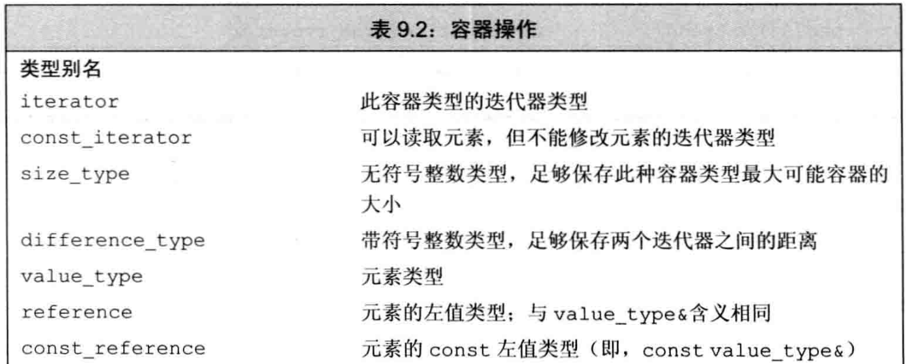

### 3.2 构造函数

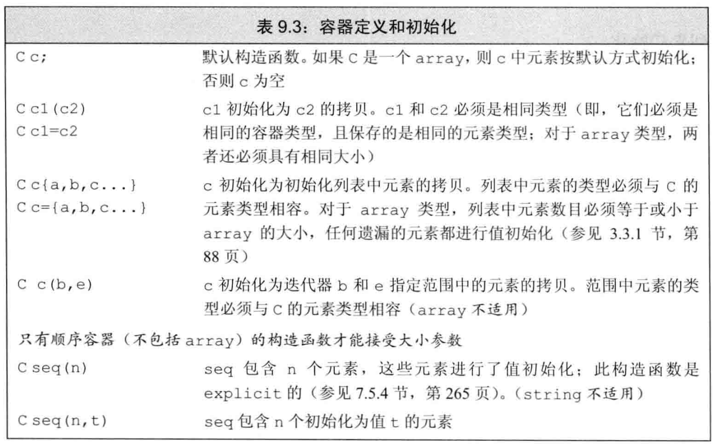

> 一般的构造函数

+ 法1: 指明容器的 `value_type`，如：
  + `std::list<string>`
  + `std::deque<std::vector<int>>`
+ 法2: 指明大小参数(`std::array`除外)
  + 如：`std::list<string> slist(10, "hi")`
  + 若没有提供初始值，则值初始化：
    + 对于内置类型或 `is_default_constructable` 的类类型，初始化
    + 否则，报错
+ `std::array` 的 ==**特殊构造规则**==：
  + 初始化时必须指明大小
    + 如：`std::array<std::string, 10>`
  + 与 C中的 `array` 不同，使用 **aggregate initialization 也需要指明大小**
    + 如：`std::array<std::string, 100> x = {"and", "or"}`
  + 初始化：
    + 对内置类型，==**默认初始化**==（即：值不确定）

> 拷贝构造

+ 法1：直接拷贝容器
  + ==**必须保证类型完全相同**==
  + 如：`std::list<std::string> list2(list1)`
+ 法2：使用迭代器拷贝
  + ==**不必保证类型完全相同**==，只要能转换即可
  + container(beg, end) 是 ==**左开右闭**== 的，==**不包括 end**== 指向的元素
  + 如：`std::forward_list<std::string> fw_list(str_vec)`
  + *: `std::array` 不支持 `c(b, e)`
    + 因为 计算 `std::array` 大小必须是 **`constexpr`** 的

> 只有顺序容器支持大小参数，关联容器不支持！

### 3.3 赋值与 swap

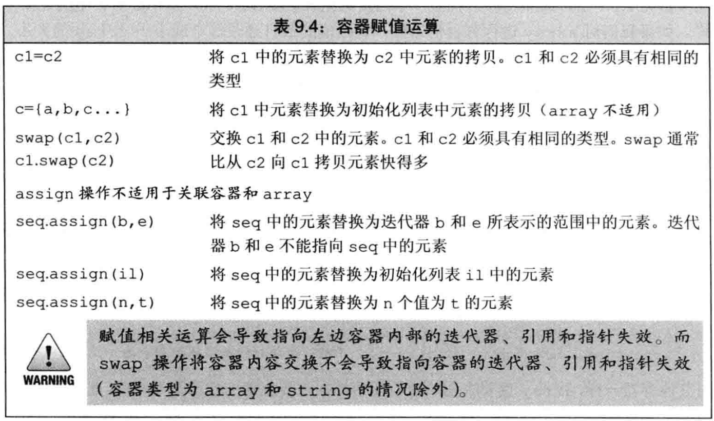

> Assign 操作

+ 版本1：`.assign(it1, it2)`
  + 替换为从 `it1` 到 `it2` 的所有值
+ 版本2：`.assign(ival, val)`
  + 替换为 `ival` 个 `val`
+ ⚠️由于旧元素被 assign 替换，==**因此迭代器失效**==

> Swap 操作

+ swap 交换两个对象
  + `a.swap(b)`
  + `swap(a, b)`
+ 除 `std::array` 外，`swap` 并不交换任何的值，而是交换容器内部数据结构
  + 保证时间为 ==**O(1)**==
  + 保证 ==**迭代器不会失效**==
    + 如，假设 `iter1` 指向 `ivec1`
    + 与 `ivec2` 交换后，`iter1` 指向 `ivec2`，即仍然指向原来的对象
+ `std::string` 交换后，迭代器失效
+ `std::array` 交换后，迭代器失效
  + 不再指向原来指向的元素，而是同位置的新元素
  + ==**可能引起 UB！**==

### 3.4 大小计算

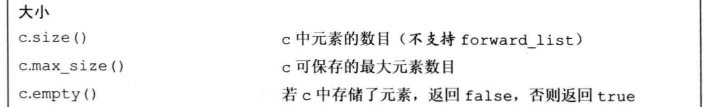

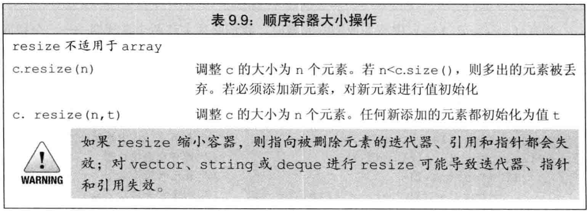

### 3.5 增/删 元素

#### 3.5.1 增加元素

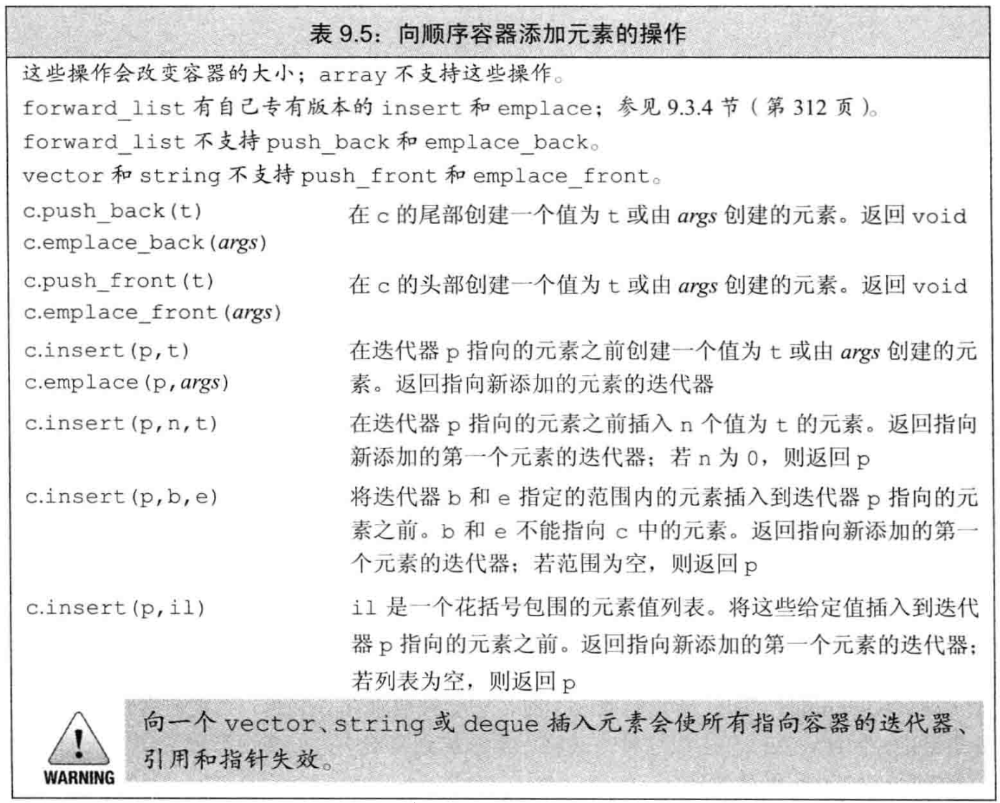

+ `push_back/push_front` 返回值：`void`
+ `insert` 返回值：
  + 若成功插入，则返回第一个插入值的 迭代器
  + 否则，返回第一个参数（位置）
+ 注意：增加元素用的迭代器 ==**不能与目标容器相同**==

> `insert` 与 `push_back` 的等价写法

```c++
std::list<string> lst;
auto iter = lst.begin();

while (std::cin >> word) {
    iter = lst.insert(iter, word); // 等价于 lst.push_back(word)
}
```

+ `emplace`: 原地构造
  + `c.emplace_back(args)`
  + 使用 `args` 在 `container` 的内存空间中直接构造对象

```c++
Sales_list.emplace_back("notebook", 25);
// 等价操作：Sales_list.push_back(Sales_data("notebook", 25));
Sales_list.emplace_back() // 默认构造一个对象
```

#### 3.5.2 删除元素

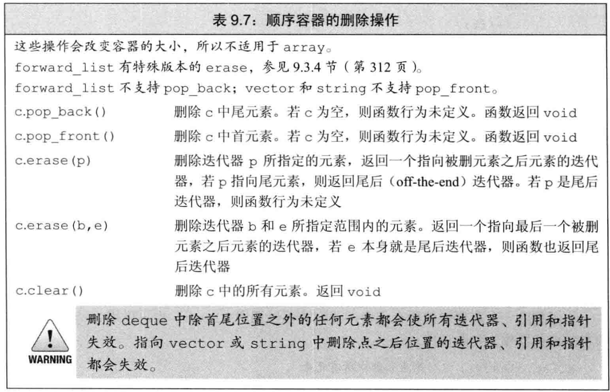


+ `erase` 操作
  + ==**左闭右开！**== [b, e) 区间删除
    + 即，`c.erase(c.begin(), c.end())` 不会导致 UB
  + 返回最后一个被删除的元素后一个元素的迭代器
    + 或者尾后迭代器

> 注意：迭代器在删除后失效

```c++
list<int> ilist = {1, 2, 3, 4, 5};
auto it = ilist.begin();

while (it != ilist.end()) {
  if (*it % 2) 
    it = ilist.erase(it) // 正确写法
    // ilist.erase(it) // 错误写法，it失效！
  else
    ++it;
}
```

### 3.6 迭代器 与 元素访问

> 迭代器

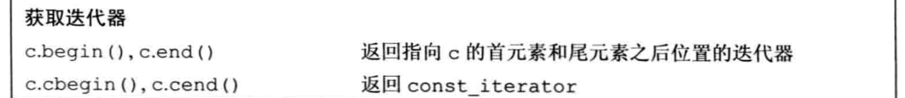
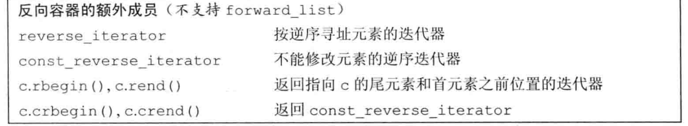

+ 迭代器的算数运算 只能用于 `vector`/`string`/`deque`/`array`
  + 如，`it + n`, `it2 - it1`, `it1 <= it2`

+ \[begin, end\) 是 左闭右开的
  + 保证：可以通过 begin++ 得到 end
  + 保证：若 begin == end, 则范围为空

> 其他访问元素的方式

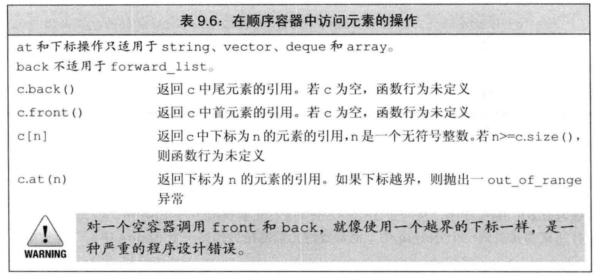

+ `.front()` 与 `.back()`
  + 除了 `forward_list` 不支持 `back()` 以外都支持
  + 必须保证容器 ==**非空**==, 否则结果 ==**未定义**==
  + 返回 ==**引用！**==

```c++
auto v = list.front();  // 获取拷贝，无法通过 v 改变容器元素
auto &v2 = list.front(); // 可以通过 v 改变容器元素
```

### 3.7 容器大小缓存管理

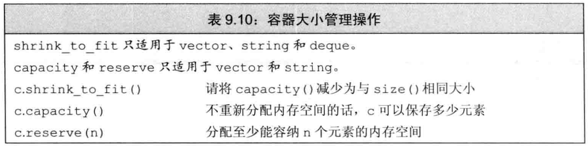

> 注：`shrink_to_fit()` 只是请求，不一定总是会归还内存
>
> 对自动管理内存的 `vector` 的思考：
> A. 从设计上说，`vector` 必须是高效的，即：`push_back()` n 次的时间不能超过 n 的常数倍
> B. 只要扩容比大于缩容比，那么就能对自动管理内存的 vector 保证均摊 O(n)，如：内存利用 < 50% 时扩容，> 25% 时候缩容
> 否则，最坏的情况一定会退化（刚好在临界情况不断扩容/缩容）

## 4. forward_list 的特殊操作

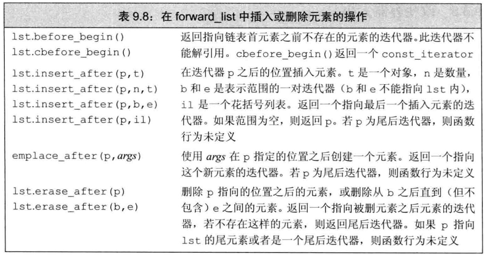

> 通过 `prev` + `curr` 迭代器来操作 `forward_list`
> 用 `prev` 判断当前元素
> 用 `prev` 删除 `*curr`

```c++
std::forward_list<int> flst = {0, 1, 2, 3, 4, 5, 6, 7, 8, 9};

auto prev = flst.before_begin();
auto curr = flst.begin();

while (curr != flst.end()) {
  if (*curr % 2) {
    curr = flst.erase_after(prev);
  }
  else {
    prev = curr;
    ++curr;
  }
}
```

## 5. string 的特殊操作

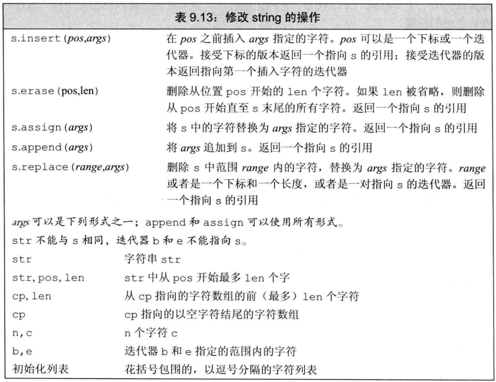
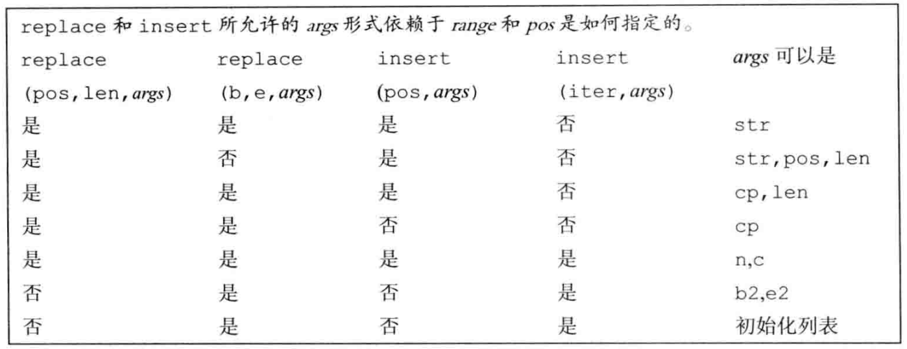

### 5.1 构造

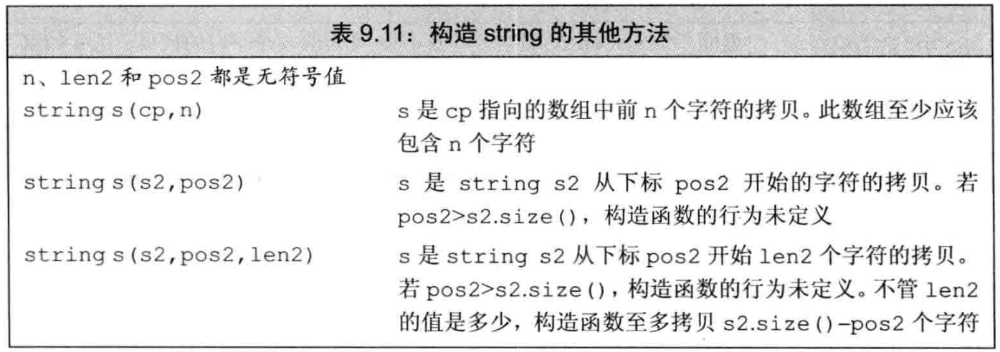

+ 法1：`std::string s(cp, pos, len);`
  + 拷贝到空字符 或 指定长度时，截止
  + 若没有空字符 或 超过 `cp` 长度，则结果未定义
+ 法2：`std::string s(str, pos, len);`
  + 最多拷贝到 字符串结尾

### 5.2 子字符串

+ `.substr(pos, n)`：从 `pos` 开始拷贝 `n` 个字符
  + 若 `n >= s.size() - pos`, 则拷贝到字符串结尾

### 5.3 额外的 `insert` 与 `erase`

+ `insert/erase` 可以接受下标 而不止 迭代器
  + `s.insert(s.size(), 5, '@')` 在 `s` 的末尾添加 5 个 '@'
  + `s.erase(s.size() - 5, 5)` 删除 `s` 的末尾 5 个元素
+ `insert/assign` 可以接受 `char []`
  + `s.assign(cp, 7)` 将 `s` 替换为 `cp` 的前7个元素
  + `s.insert(s.size(), cp + 7)` 把 `cp` 从第 7 个字符到结尾的所有字符拷贝到 `s` 的结尾
+ `string` 可以接受 `string`
  + `s.insert(pos_s, s2, pos_s2, num)` 把 `s2[pos_s2]` 到 `s2[pos_s2 + num`] 的元素 拷贝到 `pos_s`

### 5.4 额外的 `append` 与 `replace`

+ `append`：相当于 `insert` 到 结尾
  + `s.insert(s.size(), " 4th Ed")`
+ `replace`：替换内容
  + `s.repalce(pos, del_count, str)`：在 pos 前面开始，删除 del_count 个元素，插入 str

### 5.5 字符串的搜索

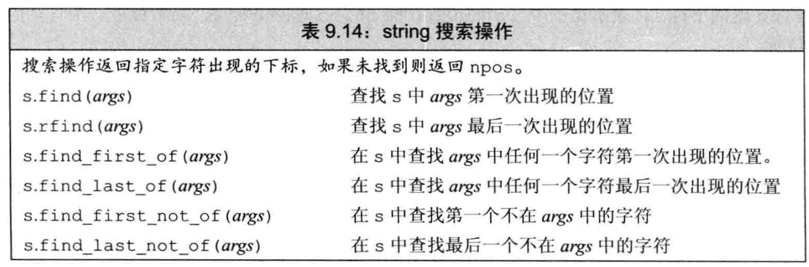
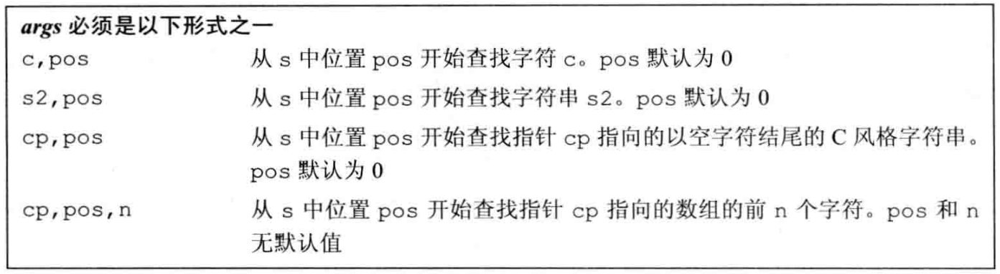

### 5.6 字符串的比较

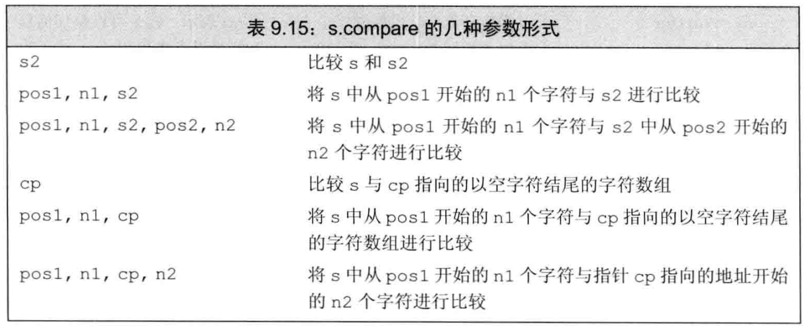

> 比较规则与 strcmp 相同！

### 5.7 数值转换

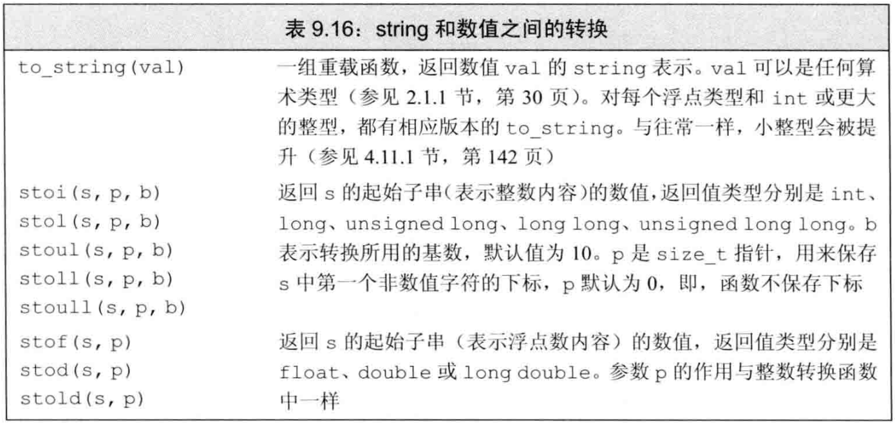

+ `std::to_string()`: 将数值转化为字符
+ `std::stod()`: 将字符串转化为 double
  + `string` 参数可以包含 0x(hex)、e(指数)...
  + 例：`std::stod("0xac19.2");`
  + 例：`std::stod(s.substr(s.find_first_of("+-.0123456789")));`
    + 可以找出第一个可能是 10 进制数字的地方

## 6. 迭代器的失效

> 添加元素

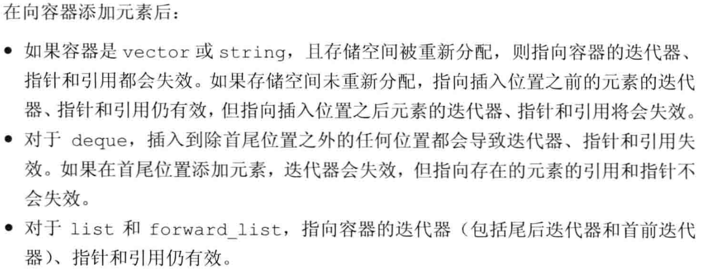

+ 对于 `deque` 的特别思考
  + ==**在中间**== 插入元素时，可能 ==**移动前半元素 或 后半元素**==
    + 故可能导致任何 ==**迭代器、引用、指针**== 失效
  + ==**在首尾**== 插入元素时，可能 ==**引起 chunk 重新分配**==
    + 故，==**迭代器**== 可能失效
    + 但没有移动元素，==**指针、引用**== 不失效

+ deque 以 O(1) 访问元素示意图

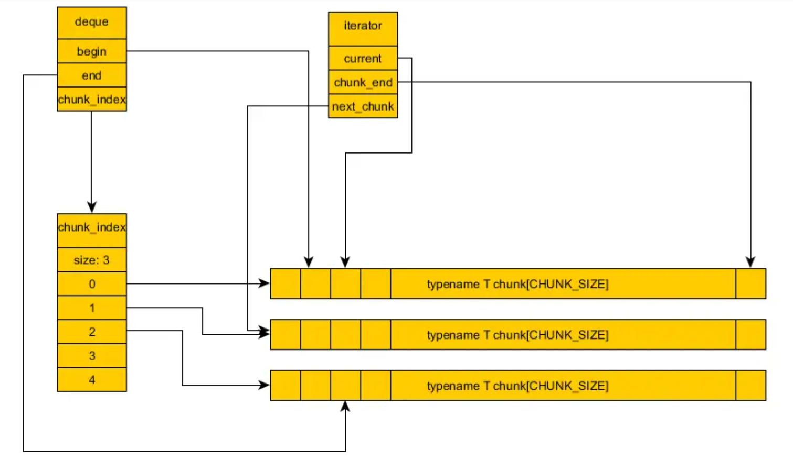

> 删除元素

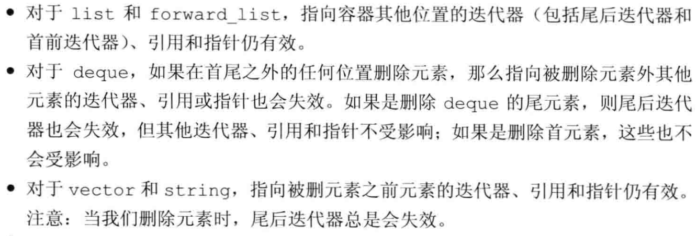

+ 总结：
  + 应当尽可能减小 需要使迭代器有效的代码片段
  + 任何改变容器元素时 应当使迭代器正确定位

## 6.1 在循环中改变容器的例子

> 删除偶数元素，复制奇数元素

```c++
std::vector<int> vi = {0, 1, 2, 3, 4, 5, 6, 7, 8, 9};
auto iter = vi.begin();

while (iter != vi.end()) {
  if (*iter % 2) {
    iter = vi.insert(iter, *iter);
    iter += 2;
  } else {
    iter = vi.erase(iter);
  }
}
```

> 不应当保存 `.end()`，因为循环时会更新

## 7. 适配器

> 顺序容器适配器：stack, queue, priority_queue

+ 可以接受一个顺序容器，使其表现的像另一种容器
  + 如：`std::stack<int> my_stack(my_deque)`
+ 也可以直接构造
  + 如: `std::priority_queue<int, vector<int>, foo>`

> 默认的情形

+ `stack` 与 `queue` 基于 `deque` 实现
+ `priority_queue` 基于 `vector` 实现

> 受到的限制

+ 必须能够添加、删除元素
  + 故不可以基于 `std::array` 构造
+ 必须可以访问尾元素
  + 故不可以基于 `std::forward_list` 构造
+ `std::queue` 要求：`front`/`push_front`/`back`/`push_back`
  + 故不可以基于 `std::vector` 构造
+ `std::priority_queue` 要求基于 `queue` 增加 随机访问能力
  + 故不可以基于 `std::list` 构造

> 容器有自身的使用方法，不能调用底层方法
> 如：默认 `stack` 为 `deque`，但不可以对 `stack` 调用 `push_back`

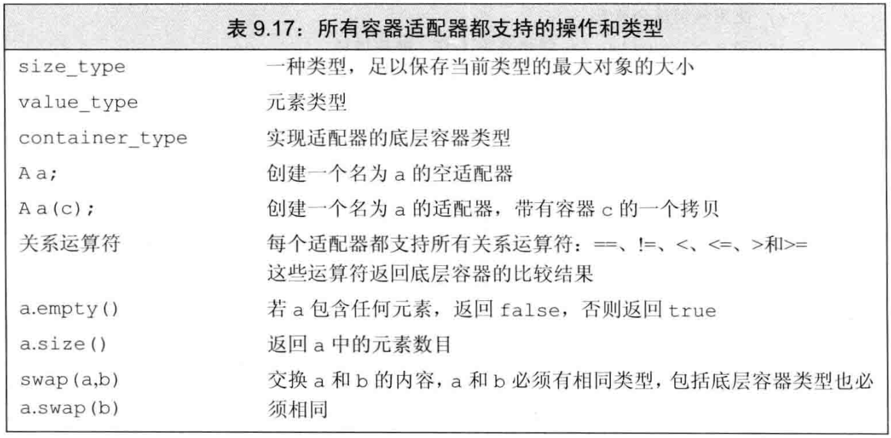

### 7.1 栈适配器

> 满足 LIFO (last in first out)

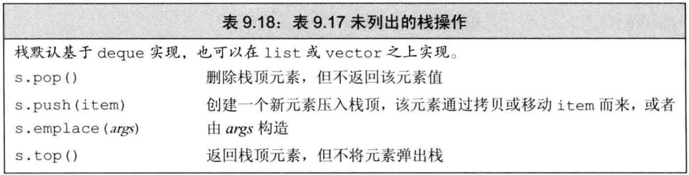

> 例：

```c++
stack<int> intStack; // 空栈
for (std::size_t ix = 0; ix != 10; ix++) {
  intStack.push(ix);
}

while (!intStack.empty()) {
  int value = intStack.top();
  intStack.pop();
}
```

### 7.2 队列适配器

> 满足 FIFO(first in first out) 原则

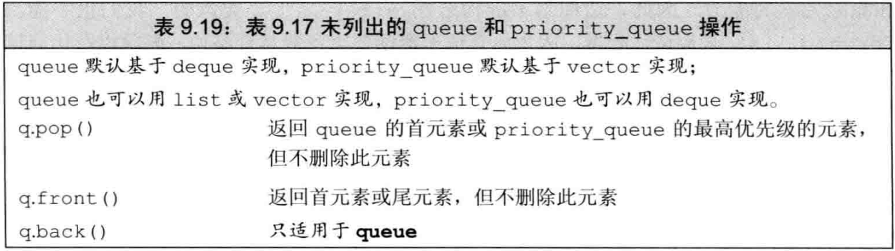
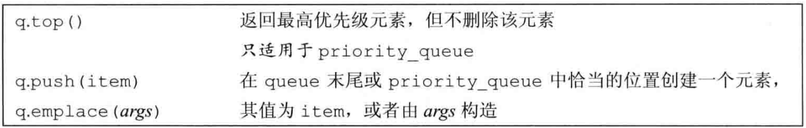
