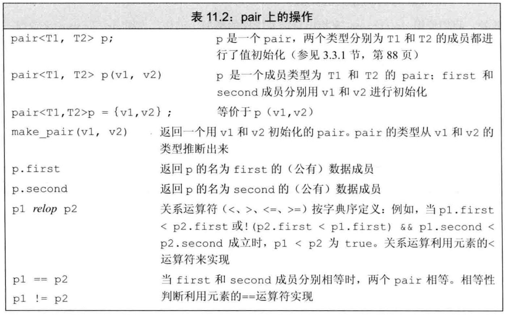
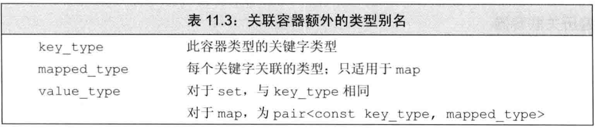
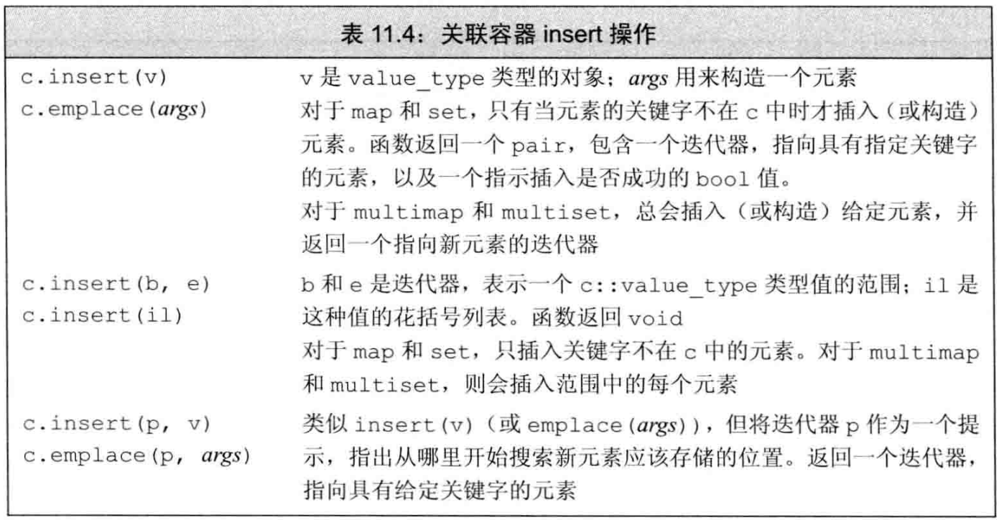
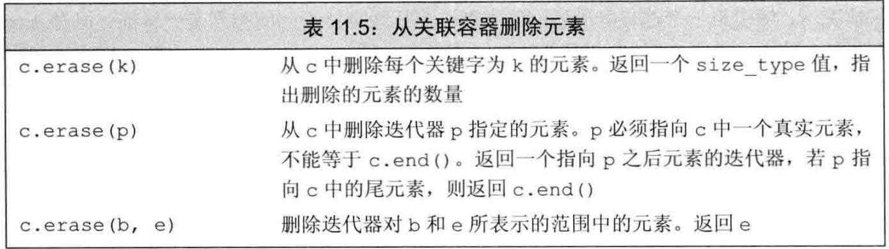
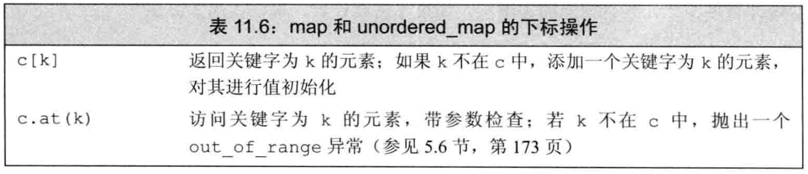
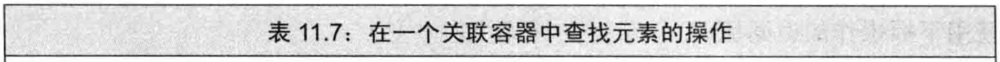
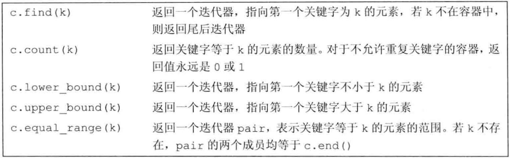
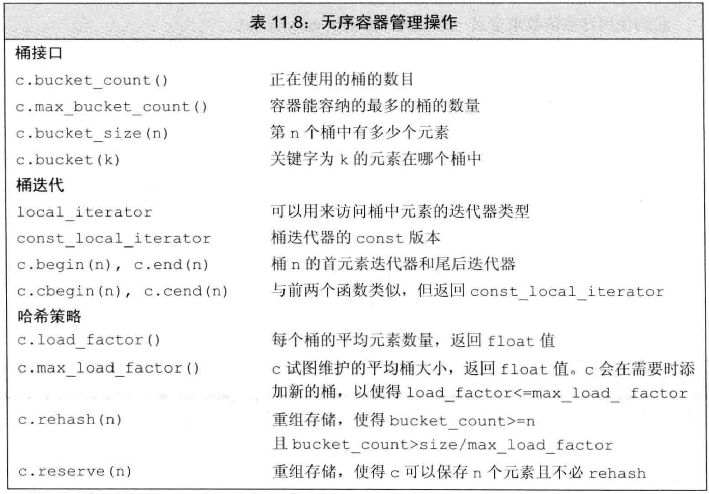

# 关联容器

## 1. 关联容器介绍

> 头文件 与 容器

| 头文件 | 容器 | 是否有序 | 容器特性 |
| --- | --- | --- | --- |
| `<map>` | `map`/`multimap` | 关键字顺序 |
| `<set>` | `set`/`multiset` | 关键字顺序 |
| `<unordered_map>` |`unordered_map`<br>`unordered_multimap` | 无序 | 使用哈希函数组织 |
| `<unordered_set>` |`unordered_set`<br>`unordered_multiset` | 无序 | 使用哈希函数组织 |
| `<utility>` | `pair` | -- | |

> 限制

+ ==**不含有与顺序相关的函数**==，如 `push_back()`
  + 因此，不能使用 `back_inserter` 等，但可以使用 `inserter`

### 1.1 定义关联容器

+ `std::map<key, value>`
  + 可默认构造为空容器
  + 可列表初始化为 `= {{key1, val1}, {key2, val2}, ...}`
+ `std::set<key>`
  + 可默认构造为空容器
  + 可列表初始化为 `= {key1, key2, ...}`
  + 可用两个迭代器初始化为 `(container.begin(), container.end())`

> 与 `map` 相关的结构: `pair`



### 1.2 关键字的要求

#### 1.2.1 有序容器的关键字

> 定义

+ 必须有定义 ==**严格弱序**==, 可以理解为 `<=`
  + 若 `k1 <= k2`, 则 `!(k2 <= k1)`
  + 若 `k1 <= k2`, 且 `k2 <= k3`, 则 `k1 <= k3`
  + 若 `!(k1 <= k2)` 且 `!(k2 <= k1)`，则定义它们 ==**等价**==; 等价关系具有 ==**传递性**==

> 使用自定义的严格弱序

+ `std::multiset<key_type, decltype(compare_func) *> container(&compare_func)`

#### 1.2.2 无序容器的关键字

## 2. 关联容器操作

### 2.1 类型别名



### 2.2 关联容器迭代器

+ `map` 的迭代器指向 `std::pair<const key, val>`
  + 如，`map_it->first = new_val` 是不可行的
+ `set` 的迭代器是 `const` 的
+ 因此，一般不对关联容器使用泛型算法
  + 或只用容器的成员算法，如 `map.find()`

### 2.3 关联容器插入元素

> set 的插入

+ 原则：若重复，则插入无效，但不会报错
+ `set.insert(val)`
+ `set.insert({val1, val2, ...})`
+ `set.insert(b, e) // 使用两个迭代器`

> map 的插入

+ `map.insert({key, val}) // 隐式构造 pair`
+ `map.insert(std::make_pair(key, val))`



> insert 与 emplace 的返回值

+ map 与 set 返回一个 `<iterator, bool>`
  + 第一个迭代器指向具有给定关键字的元素
  + 第二个反应插入是否成功

```c++
// 例：单词计数

std::map<std::string, size_t> word_count;
std::string word;

while (std::cin >> word) {
    auto ret = word_count.insert({word, 1});
    if (!ret.second) {
        ++ret.first->second;
    }
}
```

+ multimap 与 multiset 只返回一个迭代器
  + 因为插入总是成功的

### 2.4 删除元素

> erase 元素、迭代器、迭代器范围



### 2.5 下标与元素访问

> 只有 `map` 与 `multimap` 可以使用
> 不支持 `multimap` 与 `unordered_multimap`，因为会重复
> 不支持 `set`，因为没有值



+ operator[] 创建元素
  + ==**不可以**== 对 `const map` 使用！
+ .at() 检查是否存在
  + 可以对 `const map` 使用
+ 均返回 `mapped_type` 而非 `value_type`

### 2.6 查找元素

> `find` / `count`
> `lower_bound` / `upper_bound`
> `equal_range`




+ 如果关键字不再容器中，则 都返回 `map.end()`
  + 即：第一个安全插入点，不影响容器顺序

+ `[lower_bound(), upper_bound)` 的范围等价于 `equal_range()` 的范围

```c++
for (auto beg = distance.lower_bound(1), 
          end = distance.upper_bound(1); 
          beg != end; beg++) {
    std::cout << beg->second << std::endl;
  }

// 等价于
for (auto eq_range = distance.equal_range(1); 
          eq_range.first != eq_range.second; 
          eq_range.first++) {
  std::cout << eq_range.first->second << std::endl;
}
```

> 使用 map 的例子：文本转换程序

```c++
std::map<std::string, std::string> buildMap(std::ifstream& map_file) {
    std::map<std::string, std::string> trans_map;
    std::string key;
    std::string value;
    while (map_file >> key && std::getline(map_file, value)) {
        if (value.size() > 1) {
            trans_map[key] = value.substr(1);
        } else {
            exit(1);
        }
    }
    return trans_map;
}

const std::string& transform(const std::string &s, const std::map<std::string, std::string> &m) {
    auto map_it = m.find(s);
    if (map_it != m.cend()) {
        return map_it->second;
    } else {
        return s;
    }
}

void word_transform(std::ifstream &map_file, std::ifstream &input) {
    auto trans_map = buildMap(map_file);
    std::string text;
    while (std::getline(input, text)) {
        bool firstword = true;
        std::istringstream stream(text);
        std::string word;

        while (stream >> word) {
            if (firstword) {
                firstword = false;
            } else {
                std::cout << " ";
            }
            std::cout << transform(word, trans_map);
        }
        std::cout << std::endl;
    }
}

void test() {
    std::ifstream original("target.txt");
    std::ifstream mapping("map.txt");

    word_transform(mapping, original);
}

/*
Note:
    getline() 的 ifstream 版本必须引入 <fstream> !
    .substr(1) 是去除头部的空格 !
*/
```

## 3. 无序容器

### 3.1 管理无序容器的桶

> 桶接口、桶迭代器 与 哈希策略



### 3.2 定制 `hash` 操作

> 传入 定制的 `hash()` 与 `equalOp()`

```c++
using my_multiset = unordered_multiset<MyClass, decltype(my_hasher) *, decltype(my_equalOp) *>; 

my_multiset container(bucket_size, my_hasher, my_equalOp);
```

> 若类定义了 `operator==`，可以只传入 `my_hasher()`

## end
