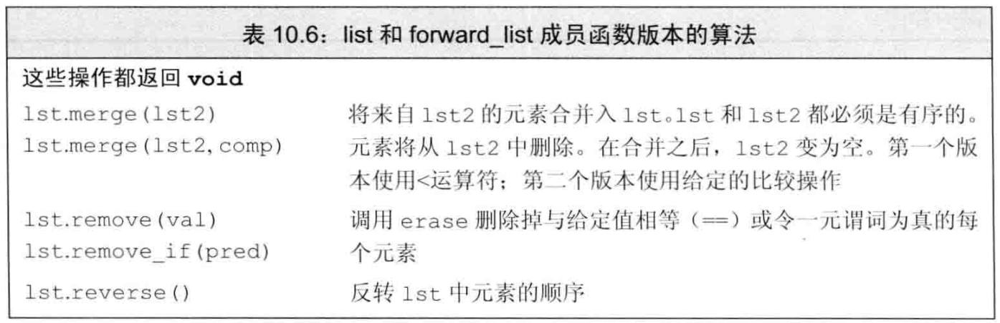

# C++ 泛型算法

## 1. 泛型算法概览

+ 泛型算法不依赖容器
+ 但依赖元素操作（如 operator==）

> 一般而言，建议使用 cbegin() 与 cend()，除非需要移动迭代器

## 2. 常见 stl 算法

### 2.1 只读算法

> 定义在 \<algorithm>

+ `std::find(begin, end, val)`
+ `std::count(begin, end, val)`
+ `std::equal(begin1, end1, begin2, end2)`
  + end2 在 c++14 中加入
  + 若只使用一个迭代器
  + 则假定 序列2 至少有与 序列1 一样多的元素，否则 UB

> 定义在 \<numeric>

+ `std::accumulate(begin, end, init)`
  + 注：`init` 参数会确定使用哪个 `accumulate`
  + 故不可以为 `""`(char [])，必须为 `std::string("")`

### 2.2 写入算法

+ `std::fill`
  + `std::fill(begin, end, val)`
  + `std::fill_n(begin, n, val)`
    + 默认假定写入不会越界！！！
+ `std::copy(begin, end, target_begin)`
  + 默认写入不会越界
  + 返回写入的最后一个元素 后面的一个位置
+ `std::replace(begin, end, old_val, new_val)`
+ `std::replace_copy(begin, end, targetIterator, old_val, new_val)`
  + 将旧的序列拷贝到 `targetIterator` 处，并替换值
  + 此处 `targetIterator` 会自增，但 `back_inserter` 自增返回自身

### 2.3 重排算法

+ `std::sort(begin, end)`
+ `std::unique(begin, end)`
  + 由 `std::swap` 实现，将重复的元素 swap 到后面
  + 返回 最后一个不重复的元素的后面一个元素 的迭代器
  + 常见操作：真正抹除重复元素
    + `auto endIter = std::unique(vec.begin(), vec.end())`
    + `vec.erase(endIter, vec.end())`

## 3. 定制操作

> 向算法传递 "Predicate": input -> bool

### 3.1 向算法传递函数

+ `std::sort(begin, end, BinaryPredicate)`
+ `std::stable_sort(begin, end, BinaryPredicate)`
  + 稳定排序：保证原本属性相同（如：二元谓词：长度）的元素，在排序后的相对顺序不被打乱
+ `std::copy_if` 与 `std::copy_if_not`
+ `std::find_if` 与 `std::find_if_not`


### 3.2 lambda 表达式

+ 定义方法：
  + `[capture list] (param list) -> return type {funtion body}`
  + 其中 [] 与 {} 不可省略
  + 如果 {} 内只有一局 return，则自动推断返回类型
    + 否则，一定为 void

> 一些栗子

```c++
auto isShorter = [](const std::string &a, const std::string &b) {return a.size() < b.size(); };

auto isBiggerThan = [size](const std::string &a) { return a.size() >= size; };
```

+ 使用 lambda 表达式
  + `std::find_if(begin, end, Predicate)`
  + `std::for_each(begin, end, foo)`

### 3.3 lambda 的捕获、返回、修改

> 捕获方式


+ 值捕获
  + 例如 `auto foo = [v1] { return v1; };`
+ 引用捕获
  + 例如 `auto foo = [&os] { os << v1; };`
  + 注意，若捕获局部变量，必须保证 lambda 执行时 ==**捕获仍然有效！！**==
    + 如，捕获了函数局部变量，但出函数时被销毁
+ 隐式值/引用捕获
  + 使用 `[=]` 或 `[&]` 来自动推断捕获列表
  + 混合使用：
    + 如 `[=, &os]` 表示 os 引用捕获，其余值捕获
    + 如 `[&, c]` 表示 c 值捕获，其余引用捕获

> 可变 lambda

+ 对于值传递的参数，lambda 无法修改其值
  + 但若加上 mutable，就可以修改
  + 如：`auto func = [v1] () mutable { return ++v1; };`

### 3.4 参数绑定

> 定义在 \<functional>

+ 方法1: 使用 `std::bind` 绑定参数值
  + `auto new_callable = std::bind(callable, arg_list)`
    + 使用 `std::placeholders::_n` 对应 n 位置的占位符
      + 一键导入：`using namespace std::placeholders`
    + 否则，可以使用实际的参数当做传参
+ 方法2: 使用 `std::bind` 改变参数顺序
  + `auto isLonger = std::bind(isShorter, _2, _1)`
  + 原理: `_2` 被映射到第二个参数，`_1` 被映射到第一个参数
+ 附: 绑定引用参数
  + 使用 `std::ref` 与 `std::cref` 返回一个值的引用，而引用是可以被拷贝的
  + 例: `std::bind(my_print, ref(os), _1, " ")`

## 4. "更多的迭代器"mod

### 4.1 插入迭代器

> 定义在 \<iterator>

+ `back_inserter`
  + 初始化：`auto it = std::back_inserter(vec);`
  + 使用：`*it = 6;` `*it = 7;`
    + 会自动在结尾添加；允许连续添加
    + 调用 `*it = 6` 时，相当于 `it = container.insert(it, val); it++`
  + 必须容器支持 `push_back`
  + `++`/`*`操作：返回 `*this`

+ `front_inserter`
  + 同 `back_inserter`
  + 但总是添加到 `container` 的头部
  + 必须容器支持 `push_front`

+ `inserter`
  + 初始化: `auto it = std::inserter(vec, it0)`

### 4.2 流迭代器

#### 4.2.1 istream_iterator


+ 绑定到流的迭代器
  + `istream_iterator<int> int_iter(cin)`
+ 默认初始化的流迭代器是尾后迭代器
  + `istream_iterator<int> int_eof`
    + 当读入完毕或 ==**发生错误**== ，则 自动将当前迭代器置为尾后迭代器

> 操作迭代器读入流

```c++
while (int_iter != int_eof)
    vec.push_back(*int_iter++)

// 或者

std::istream_iterator<int> int_iter(std::cin), eof;
std::vector<int> vec(int_iter, eof);
```

+ `istream_iterator` 在 ==**解引用之前**== 就一定 ==**已经完成读取**== 数据！！

#### 4.2.2 ostream_iterator


+ 只要 `val` 是可以被 `<<` 输出的，就可以定义 `os_iter`

> 使用 `ostream_iterator` 输出 值的序列

```c++
ostream_iterator<int> os_it(std::cout, " ");

for (auto e : vec)
    *os_it++ = e;
std::cout << std::endl;

// 或者

std::copy(vec.begin(), vec.end(), os_it);
std::cout << std::endl;
```

### 4.3 反向迭代器


> 例：反向排序 vector

```c++
std::sort(vec.rbegin(), vec.rend());
```

> 反向迭代器需要递减运算符

+ `forward_list` 与 `ostream_iterator` 等不可以使用反向迭代器

> 把 反向迭代器 转换成 正向迭代器

+ `.base()` 函数
  + 由于左开右闭区间的特性，`.base()` 生成右侧相邻位置的正向迭代器
  + 从而，以下两个区间相同（顺序相反）
    + `[line.cbegin(), rcomma)`
    + `[rcomma.base(), line.cend())`


```c++
auto rcomma = std::find(line.crbegin(), line.crend(), ',')
std::cout << std::string(line.crbegin(), rcomma) << std::endl;
// 错误，会逆序输出最后一个单词，如 rco_tcaresset 而非 tesseract_ocr
std::cout << std::string(rcomma.base(), line.crend())
// 正确，使用 .base() 来获取一个正向迭代器
```

> 把 正向迭代器 转换成 反向迭代器

```c++
auto riter = std::make_reverse_iterator(++iter);
```

## 5. 泛型算法结构

### 5.1 五类迭代器

| 迭代器类型 | 特性 | 例子 | 支持特性 |
| --- | --- | --- | --- |
| 输入迭代器 | 只读不写，单遍扫描，只能递增 | istream_iterator | `==`/`!=` <br> `++` <br> `*`/`->` |
| 输出迭代器 | 只读不写，单遍扫描，只能递增 | ostream_iterator | `++`/`*` |
| 前向迭代器 | 可读写，多遍扫描，只能递增 | std::forward_list::iterator | 输入 + 输出 |
| 双向迭代器 | 可读写，多遍扫描，可递增递减 | std::list::iterator | 前向 + `--` |
| 随机访问迭代器 | 可读写，多遍扫描，支持所有迭代器运算 | std::vector::iterator | 双向 + 算数运算/下标 |

+ 很多算法有最小要求的迭代器，如 `std::find` 至少要求输入迭代器
  + 算法的迭代器参数的 ==**类型错误**== 时，==**编译器不会警告！**==
  + 如，`std::sort` 要求 ==**随机访问迭代器**==

### 5.2 算法形参结构

> 基于迭代器的重载

+ `std::alg(beg, end, other_args)`
+ `std::alg(beg, end, dest, other_args)`
  + 假定 ==**目标空间足够容纳所有元素**==
  + dest 可以是一个指向容器的迭代器，也可以是一个插入迭代器
+ `std::alg(beg, end, beg2, other_args)`
  + 假定 ==**目标空间足够容纳所有元素**==
+ `std::alg(beg, end, beg2, end2, other_args)`
  + 假定 ==**目标空间足够容纳所有元素**==

> 其他重载

+ `std::alg_if(args, Predicate)`
+ `std::alg_copy(args)`
+ `std::alg_copy_if(args)`

## 6. 特殊容器算法

> 对于一些操作，应当优先使用容器特定算法

### 6.1 list 与 forward_list

+ 如 `std::sort` 要求随机访问迭代器，但 `list` 没有
+ 又比如 `std::sort` 要求交换元素，但 `list` 可以直接改变元素间链接

> `list` 的私有操作：`merge`/`remove`/`reverse`/`sort`/`unique`




> `list` 的独有操作：`spice`


