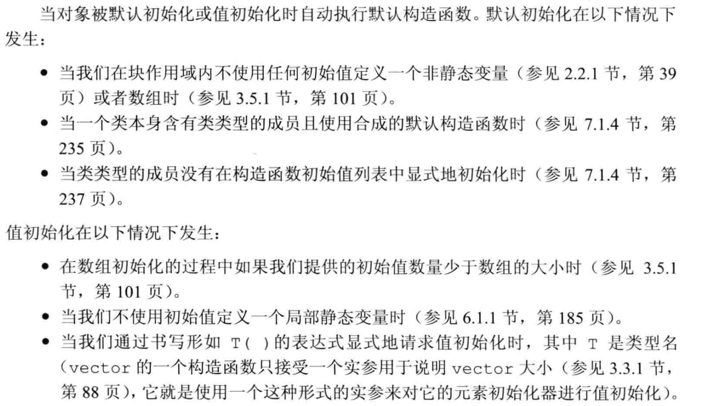

# C++ 类

## 1. 定义类

+ 引入

```c++
struct Sales_data {
    string isbn() const { return bookNo; }
    Sales_data& combine(const Sales_data&);
    double avg_price() const;
    string bookNo;
    unsigned units_hold = 0;
    double revenue = 0.0;
};
```

### 1.1 this 的引入

+ 以 isbn() 为例
  + return bookNo
  + 实际上隐式返回了 this.bookNo
+ 成员函数通过 this 的隐式参数访问调用的对象
  + this 是对象的地址
  + 任何对类成员的访问实际上都看做对 this 的隐式引用
  + this 是总是指向对象的常量指针，无法修改保存的地址
  + 默认类型是 Sales_data *const

#### 1.1.1 定义返回 this 的函数

+ 此处模仿 c++ 内置赋值运算符的特性：返回左值
+ 因此返回一个引用

```c++
Sales_data& Sales_data::combine(const Sales_data &rhs) {
    units_hold += rhs.units_hold;
    revenue += rhs.revenue;
    return *this;
}
```

+ 返回 *this，则允许连续操作，如：myScreen.move().set_cursor()
  + 期间 this 指针自动在成员之间隐式传递
+ 但是，const 成员函数只能返回对 \*this 的常量引用，==**因此不能修改**==

### 1.2 类作用域 与 作用域运算符

#### 1.2.1 类的作用域

+ 类本身是一个作用域
  + c++ 处理类的过程是先编译所有的声明，再编译函数体定义
+ 处理声明时，规则同其他的作用域（如for while）
  + 如：
    + 声明 Money 时，向外查找到外部的 typedef
    + balance 返回 bal 时，由于定义在类完全可见后编译
      + 因此能返回 private 里的 bal
+ 不允许在类中重新定义一个名字，如果这个名字已经被类成员使用过，且在外部已经被定义成类型
  + 一般把类型名称定义在类开始处，确保所有成员都定义之后

```c++
typedef double Money;
class Account {
    public:
        Money balance() {return bal;}
    private:
        typedef double Money; // 错误，不允许重新定义类
        Money bal;
}
```

#### 1.2.2 作用域运算符

+ 显式调用某个名字
  + Screen::height / this->height 强制调用类的成员
  + ::height 强制调用 全局height
  + height 默认调用函数参数 height

### 1.3 类的成员函数

#### 1.3.1 const 成员函数

+ const 成员函数
+ 如，string isbn() ==const== {return bookNo;}
  + 称为 常量成员函数
  + 作用：修改 this 指针 的类型 -> const Sales_data *const
  + 原因：常量对象，常量对象的引用和指针 都 ==**只能调用常量成员函数**==
+ 基于 const 的重载
  + 如需要对 display 的返回对象修改，那么显然 non-const版函数 更好
  + 特殊的，如 .at() 函数，需要基于 const 重载防止返回可修改的左值引用
  + 必须视对象为 const ==**否则无法区分重载**==！！
+ 注意：const 对象 ==**不能调用**== non-const 成员函数！！
  + 相比之下，non-const 对象调用 non-const 成员函数（完美匹配）

```c++
class Dynarray {
  std::size_t m_size;
  int *m_storage;
  public:
  const int &at(std::size_t n) const { 
    // 必须视对象为 const 否则无法区分重载！！
    return m_storage[n];
  }
  int &at(std::size_t n) {
    return m_storage[n];
  }
};
```

+ 用 non-const 版定义 const 版重载函数
  + 先 static_cast\<const className *>(this)
  + 再调用函数...（此时自动匹配 const 版本）
  + 再 const_cast\<className>(this) （去除底层 const）

```c++
class Dynarray {
  public:
  const int &at(std::size_t n) const {
    return m_storage[n];
  }
  int &at(std::size_t n) {
    return const_cast<int &>(static_cast<const Dynarray *>(this)->at(n));
  }
};
```

> 先添加 const 再去除是安全的，反之则容易是灾难的

#### 1.3.2 mutable 可变数据成员

+ mutable 关键字
+ const 成员函数可以修改可变成员的值，无论它是否 const 对象成员
+ 写法：在定义成员时使用 mutable int x = 0;
  + 随后可以再如 void foo() ==**const**== {x = 1;} 中修改 x 的值，即使是 const 对象

#### 1.3.3 inline 成员函数

+ 显式使用内联函数 inline
  + 可以在定义 或 声明的时候写 inline；可以重复写
  + 最好在类外部定义的地方说明 inline，增强可读性
+ 同一般 inline 函数，应当与相应的类定义在同一个头文件中

#### 1.3.3 在类外部定义成员函数

+ 必须与类内的声明保持一致，包括 const 等
+ 必须指明其所属于的类名

```c++
double Sales_data::avg_price() const {
    if (units_hold) {
        return revenue/units_hold;
    } else {
        return 0;
    }
}
```

#### 1.3.4 定义类相关的非成员函数

+ 应与类声明放在同一个头文件中
+ 注意点
  + istream 和 ostream 是不可拷贝的，只能引用传递
  + istream 和 ostream 会改变，不可使用常量引用
  + 一般而言 ==**不应在输出中控制格式，以保留用户控制格式的权利**==
    + 此处只是为了正常打印方便

```c++
istream &read(istream &is, Sales_data &item) {
    double price = 0;
    is >> item.bookNo >>  item.units_hold >> price;
    item.revenue = price * item.units_hold;
    return is;
}

ostream &print(ostream &os, const Sales_data &item) {
    os << item.isbn() << " " << item.units_hold << " "
        << item.revenue << " " << item.avg_price();
    return os;
}
```

#### 1.3.5 类成员函数的初始值

+ 类数据成员的初始值，必须使用 = 或 {} 初始化

```c++
class Screen {
    // omitted....
};

class ScreenMgr {
    public:
        //omitted...
    private:
        vector<Screen> manageList = {Screen(height, width)};
        // 此处必须用 = 或 {} 初始化，不可以使用 () 初始化
};
```

### 1.4 类类型

+ 不完全类的声明
  + 如 class Screen;
  + 不完全类型；不能用于定义变量
  + 能够声明以此为参数的函数形参或返回值，或指针、引用

### 1.5 类的 static 成员

+ 有时，我们希望一些数据与类相关，与对象无关（如，汇率）
+ 一旦汇率变化，所有的对象都可以用新值

#### 1.5.1 类 static 数据成员的特点

+ 同 C，编译时即分配好内存
+ 无法在类内初始化
  + 若为 const 或 constexpr，则可以提供初始化
  + 如，static constexpr int x = 10;
  + 应当 ==**在类外单独初始化一下**==：
    + type className::identifier = value;
+ 不属于任何对象，但可以通过 类名::成员 访问
  + 当然也可以通过 a.成员 或 b.成员访问，此时访问的是同一个
+ 静态成员可以是不完全类型
+ 静态成员可以作为默认实参，但一般数据成员不可以

```c++
class Bar {
    public: //...
    private:
        static Bar mem1;  // 正确，static 对象可以是不完全类型
        Bar *mem2;  // 正确，指针可以是不完全类型
        Bar mem3;   // 错误，数据必须是完全类型
};
```

#### 1.5.2 定义类的 static 数据成员

+ 一般定义在任何函数外

  + 也因此生命周期 = 程序生命周期
+ 只能定义一次

```c++
double Account::interestRate = initRate();
// 自 Account:: 后都是 class 的作用域，因此可以直接调用类的函数 initRate()
```

#### 1.5.2 类 static 函数的特点

+ 不与对象绑定
+ 不含有 this 指针，也无法声明为 const 的
+ 不能操作 non-static 的类成员
+ 可以通过 类名::静态函数() 调用
+ 可以在类内外定义，但在 **类外不能重复 static 关键字**

## 2. 访问控制与封装(encapsulation)

### 2.1 访问说明符

#### 2.1.1 public

+ 表示成员可以在整个程序内被访问
+ 用于定义类的接口

#### 2.1.2 private

+ 可以被类的成员函数访问，但不能被使用类的代码访问
+ 封装了类的实现细节

#### 2.1.3 friend

+ 友元函数
  + 允许外部的函数接口访问类的成员
  + 不是类的成员！
+ 友元类
  + 使另一个类有访问私有的权限
  + 友元 ==**不能传递、继承**==，每个类只能被自己的友元类/函数操作
  + 友元必须已经被声明（不必被定义）

```c++
class Screen {
    friend class Window_mgr;
    ...
}

class Window_mgr {
    public:
        using ScreenIndex = std::vector<Screen>::size_type;
        void clear(ScreenIndex);
    private:
        std::vector<Screen> screens{Screen(24, 80, ' ')};
}

void Window_mgr::clear(ScreenIndex i) {
    Screen &s = screens[i];
    s.contents = string(s.height * s.width, ' ');
}
```

+ 友元声明与作用域

  + 友元并不是函数声明，只是权限声明
  + 使用了友元声明，调用 f 仍然会调错"f未定义"
  + ==**因此，通常把这些声明与定义类的头文件放在一起**==
+ 重载函数与友元

  + 不同的重载函数视为不同函数，需要分别友元声明
  + 如：
    + friend foo(int x, int y);
    + friend foo(int x);

### 2.2 \*补充: struct 与 class 的==唯一==区别

+ struct 默认 public
+ class 默认 private

> 代码修改为如下

```c++
class Sales_data {
    friend istream &read(istream &is, Sales_data &item);
    friend ostream &print(ostream &os, const Sales_data &item);

    public:
        Sales_data() = default;
        Sales_data(const string &s): bookNo(s) {}
        Sales_data(const string &s, unsigned &n, double p):
                bookNo(s), units_hold(n), revenue(p*n) {}
        Sales_data(istream&);
  
        string isbn() const { return bookNo; }
        Sales_data& combine(const Sales_data&);

    private:
        double avg_price() const {
            return units_hold ? revenue/units_hold : 0;
        };
        string bookNo;
        unsigned units_hold = 0;
        double revenue = 0.0;
};

Sales_data::Sales_data(istream &is) {
    read(is, *this);
}

Sales_data& Sales_data::combine(const Sales_data &rhs) {
    units_hold += rhs.units_hold;
    revenue += rhs.revenue;
    return *this;
}

istream &read(istream &is, Sales_data &item) {
    double price = 0;
    is >> item.bookNo >> item.units_hold >> price;
    item.revenue = price * item.units_hold;
    return is;
}

ostream &print(ostream &os, const Sales_data &item) {
    os << item.isbn() << " " << item.units_hold << " "
        << item.revenue << " " << item.avg_price();
    return os;
}

```

## 3. 构造函数

> 类通过一系列特殊的函数来控制一个对象的初始化过程
> 只要对象被创建，就会执行构造函数

### 3.1 基础概念

+ 构造函数没有返回类型
+ 类似重载函数，可以有多个构造函数
+ 构造函数不能被声明为 const
  + 创建 const 对象时，直到构造结束才取得 const 属性
  + 期间构造函数可以修改对象
+ 定义默认对象的方法
  + Sales_data cprimer(); 是 ==**函数！！！**==
  + Sales_data cprimer; 才是 ==**对象**==，由默认构造函数生成

#### 3.1.1 默认构造函数消失的条件

+ 如果用户定义了任何构造函数，编译器不会合成默认构造函数

### 3.2 构造函数初始值列表

#### 3.2.1 初始值列表的语法

+ 使用一个成员名字的列表，如：
  + Book(string s, int n, double p) : bookNo(s), units_hold(n), revenue(p*n) {}
  + 并将初始值用于初始化成员
+ 若没有初始化，则与 default 的行为相同
  + 使用类内默认初始值 或 默认初始化
+ 构造函数不应覆盖类内初始值，除非不同
+ {} 内的行为用于运行其他的任务，可为空

#### 3.2.2 必须使用初始值列表的情形

+ 一般而言，习惯于在初始值列表 中 显式初始化 所有成员
+ 若没有，在函数体执行前使用默认初始化
  + 如，Sales_data(const string &s) /\*此处执行默认初始化\*/ {bookNo = s /\*再进行赋值\*/}
+ 因此，==**const 成员与 引用成员 必须立即初始化**==，通过构造函数初始值列表
  + 初始化与赋值的区别
    + 前者直接初始化，后者先初始化再赋值
    + 有些成员必须初始化，所以 ==**推荐使用函数初始值列表**==

#### 3.2.3 初始化的顺序

+ 函数初始值列表 与 初始化顺序无关！
+ 而是与 ==**类定义中出现的顺序一致！！！**==
+ 尽量不要用一些成员初始化其他成员 或 打乱顺序，而是写成与定义顺序相同

### 3.3 可以在类外部定义构造函数

> 类外定义构造函数的例子

```c++
Sales_data::Sales_data(istream &is) {
    read(is, *this);
}
```

### 3.4 默认构造函数 与 隐式类型转换

#### 3.4.1 定义默认构造函数

+ 规则如下
  + 若存在类内初始值，用它初始化成员
  + 否则，默认初始化成员
+ 一般不建议不写构造函数
  + 除非全部拥有默认初始值
  + 否则，如数组、指针可能有未定义的值
  + 同时，有时编译器无法合成默认构造函数

> 构造函数的例子

```c++
struct Sales_data {
    // 新增的构造函数
    Sales_data() = default;
    Sales_data(const string &s): bookNo(s) { }
    Sales_data(const string &s, unsigned &n, double p):
            bookNo(s), units_hold(n), revenue(p*n) { }
    Sales_data(istream&);
  
    // 原本的函数
    string isbn() const { return bookNo; }
    Sales_data& combine(const Sales_data&);
    double avg_price() const;
    double test();
    string bookNo;
    unsigned units_hold = 0;
    double revenue = 0.0;
};
```

#### 3.4.2 default 与 delete

+ =default 的含义
  + Sales_data() = default;
  + 要求编译器自动生成 构造函数
  + 可以和声明出现在类的内部，也可以作为定义出现在外部
  + 内部时，默认内联；否则不是
+ =delete 的含义
  + Sales_data() = delete;
  + 删除默认构造函数，不允许默认构造

#### 3.4.3 默认初始化 与 值初始化的区别



#### 3.4.4 默认构造函数 与 隐式类型转换

+ 构造函数的也定义了转换为此类型的隐式转换机制
  + 但只能进行一步转换，不能自动完成 char [] --隐式--> string --隐式--> myClass --> 函数调用 这样的转换
    + 如，foo("1234")
  + 可以 string --隐式--> myClass --> 函数调用
    + 如，foo(string("1234"))
    + 或，foo(myClass("1234"))
+ 需要 ==**多个实参**== 的构造函数 ==**不能**== 用于隐式类型转换
+ 使用 ==**explicit**== 关键字以禁止隐式类型转换
  + 只能直接初始化
  + ==**禁止拷贝初始化**==
  + 但此时仍然 ==**可以**== 显式地将 其他类型 转换成 自己的类型
    + 如，Sales_data("12345") // char [] -> string
+ 只能在 ==**类内声明构造函数时**== 使用 explicit

### 3.5 委托构造函数 (Since C++11)

+ 委托构造函数
  + 可以把构造函数的任务 委托给 另一个构造函数

> 使用委托的例子

```c++
class Book_data {
    public:
        Book_data(string s, double d) : name(s), price(d) {}
        Book_data() : Book_data("", 0) {} // 委托上一个函数构造
  
    private:
        string name;
        doubel price;
}
```

---

## 4.聚合类

### 4.1 聚合类的定义

+ 所有成员 public
+ 没有构造函数
+ 没有基类、virtual 函数
+ 没有类内初始值

```c++
struct Data {
    int ival;
    string s;
}
```

### 4.2 聚合类的特点

+ 可以像 C 的结构体一样定义、操作
+ 不接受 C 结构体的 .name 方法初始化，必须严格 ==**按照声明顺序初始化**==

```c++
Data a = {1, "abc"}; // 可以
Data b = {"abc", 1}; // 不行
Data c = {.ival = 1, .s = "abc"} // 不行
```

### 4.3 聚合类 与 字面值常量类

#### 4.3.1 字面值常量类的定义

+ 数据成员都是字面值类型的聚合类 是 字面值常量类
+ 对于不是聚合类的类，若满足以下，也是 字面值常量类
  + 数据成员都是字面值类型
  + 至少含有一个 constexpr 构造函数
  + 若一个数据成员含有 类内初始值
    + 初始值必须是常量表达式
    + 或数据成员时类时，使用其 constexpr 构造函数
  + 使用析构函数的默认定义
+ **总结**：类必须可以在【**编译期**】被构造

#### 4.3.2 定义字面值常量类

+ constexpr 构造函数
  + 函数体一般是空的
  + 必须初始化所有数据成员，初始值，或使用 constexpr 构造函数，或是常量表达式
+ constexpr 构造函数用于生成 constexpr 对象以及 constexpr 函数的参数或返回类型

> 例：写一个 Debug 字面值常量类

```c++
class Debug {
    public:
        constexpr Debug(bool b = true) : hw(b), io(b), other(b) {}
        constexpr Debug(bool h, bool i, bool o) : hw(h), io(i), other(o) {}
        constexpr bool any() const { return hw || io || other; }
        // 此处 const 表示视对象为 const
        // 与 constexpr 【函数】：视对象为编译期可调用 的含义不同
        // 但必须存在，否则无法对 constexpr 变量调用
        void set_io(bool b) { io = b; }
        void set_hw(bool b) { hw = b; }
        void set_other(bool b) { other = b; }
    private:
        bool hw;        // hardware err
        bool io;        // io err
        bool other;     // other err
};

int main() {
    constexpr Debug io_sub(false, true, false);

    if (io_sub.any()) {
        cout << "any error msg" << endl;
    }
    return 0;
}
```
