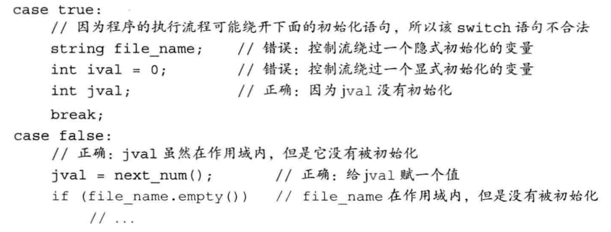
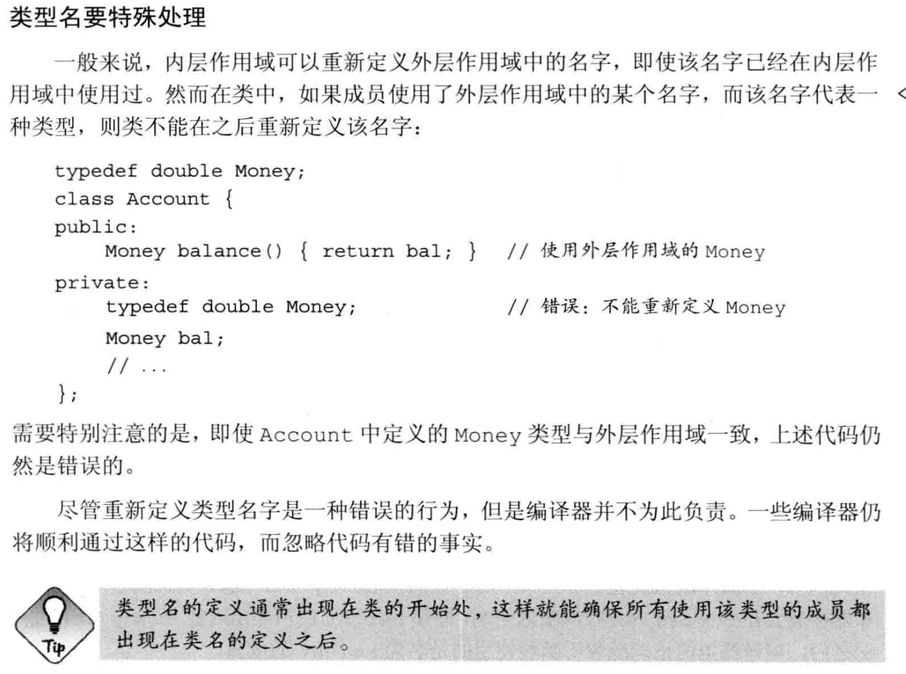
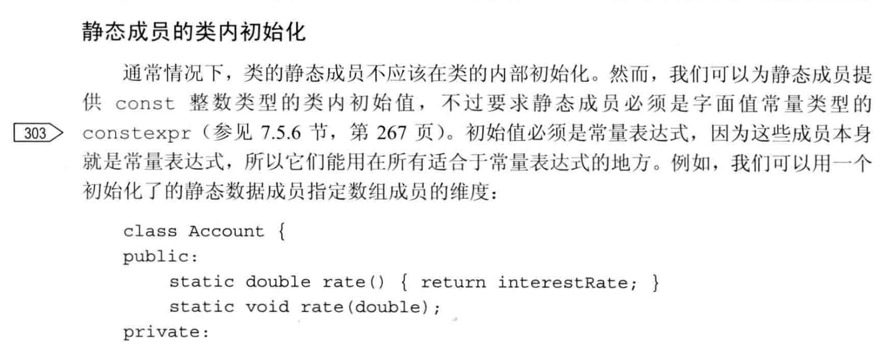
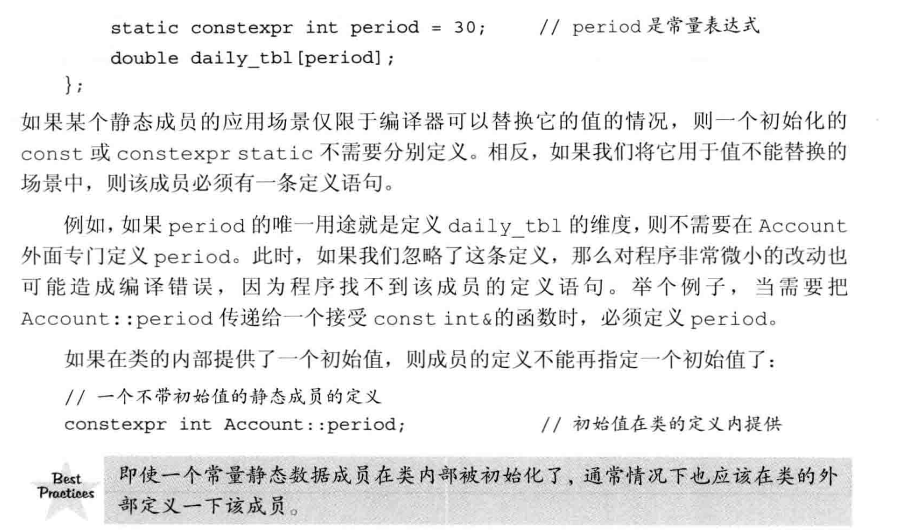
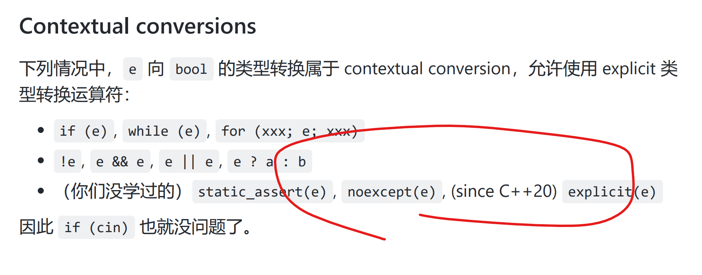
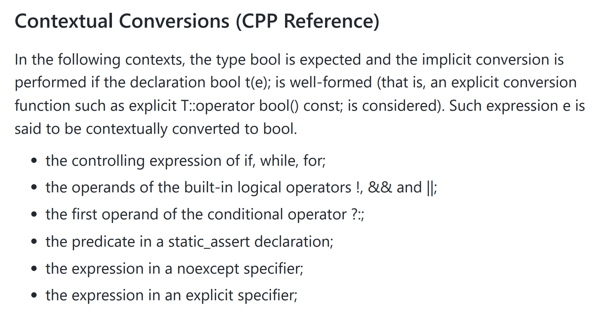
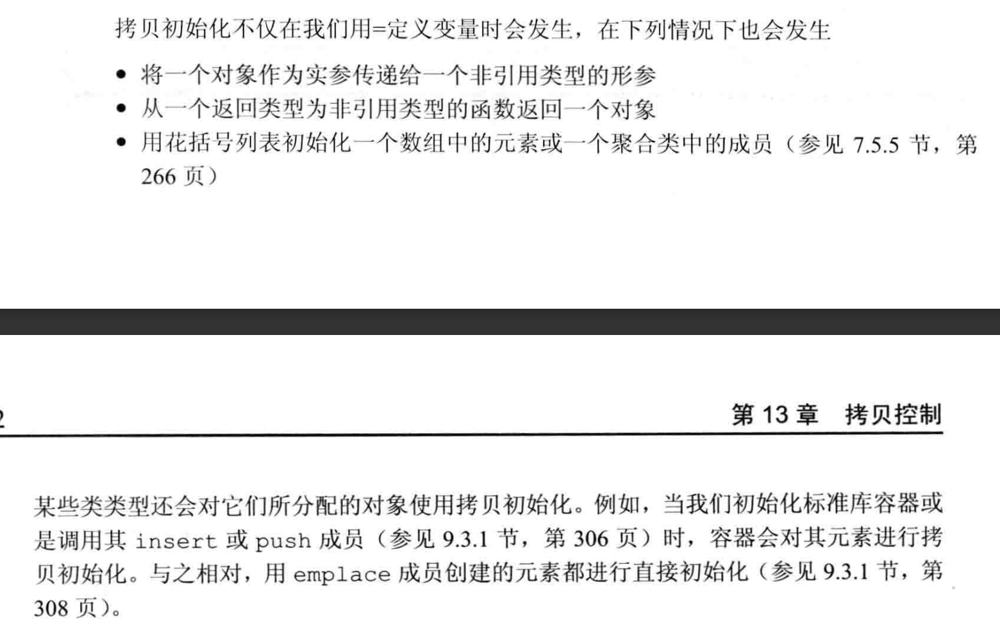
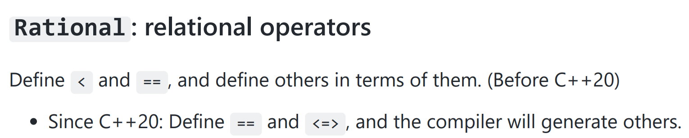

# C++ 未解决的问题

## 1. cmath 设计缺陷？

## 2. 9种初始化的invoke条件？

## 5. constexpr/consteval 有什么区别？

## 6. push_back 与 emplace_back 的区别和实现？

## 7. 如何方便地对 vector 取 slicing 操作？

## 9. switch语句

+ 为什么 switch 语句可以跳过声明，但不能从带有初始化的部分跳到下一个case?

> 若某处一个带有初值的变量位于作用域外，另一处位于作用域内，则非法
> 如果需要为 case 定义变量，最好放在 case 后的 {} 块作用域内

```c++
int a = 0;
cin >> a;

switch (a) {        // 合法
    case 0:
        int jval;
        cout << "None";
        break;
    case 1:
        jval = 1;
        cout << "Value:" << jval;
        break;
}

switch (a) {        // 非法
    case 0:
        int jval = 0;
        cout << "None";
        break;
    case 1:
        jval = 1;
        cout << "Value:" << jval;
        break;
}
```

> 附：c++ primer 中的案例
> 

## 11. 为什么这段代码是错误的？（在我的电脑上没有编译错误，也没有发生未预期的结果）



## 13. 这段关于 类静态成员初始化的内容是什么意思？




## 14. ?: 为什么不能被重载？什么地方不被求值？

## 15. contextual conversion




## 16. 动态类型 与 静态类型 是同时拥有的一种“属性”吗

---

## 挖坑

## 1. emplace



## 2. rvalue explained [http://thbecker.net/articles/rvalue_references/section_01.html](http://thbecker.net/articles/rvalue_references/section_01.html)

## 3. C++ Primer 13.4 拷贝控制实例

## 4. C++ Primer 13.5 动态内存管理类

## 5. deducing-this

[deducing this from cppref](https://en.cppreference.com/w/cpp/language/member_functions#Explicit_object_parameter)

## 6. 接受 auto 的函数形参（since c++20）

## 7. 参考 Effective Modern C++ Item 21 (based on C++14)

+ 关于 推荐用 auto ... make_shared/unique 而非 直接构造

## 8. 自定义方法

+ 自定义 deleter 与 allocator
  + shared_ptr 与 unique_ptr

## 9. 一些运算符的作用

+ ?: 运算符
+ .* 运算符

## 10. 序运算符



## 11. (c++23) member access

[member access by a.operator[](i, j, k)](https://en.cppreference.com/w/cpp/language/operator_member_access#Built-in_subscript_operator)

## 12. vtable 是什么？作用？
